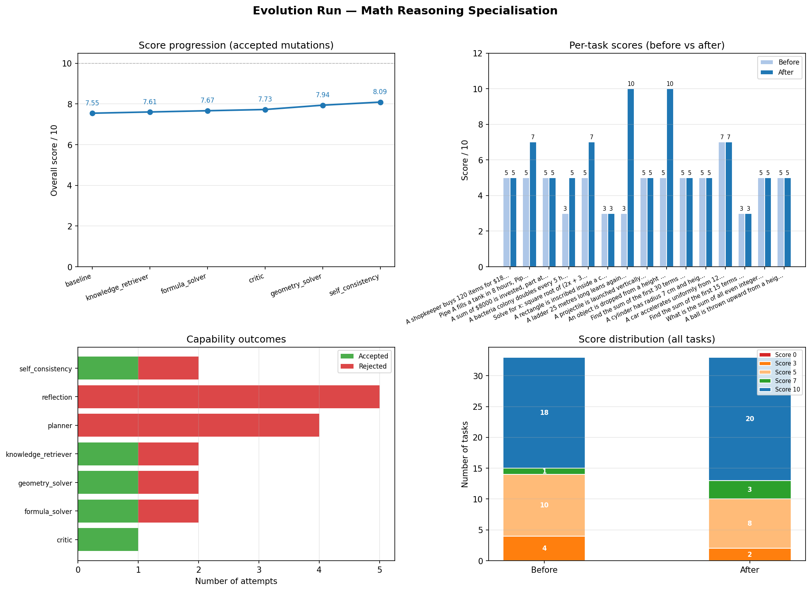

# STEM Agent for Mathematical Reasoning

Project by Ognjen Obradovic
for the JetBrains LLM Intern Position

## Motivation

Most AI agent are built with a fixed set of tools, prompts and retrieval methods. This fact makes them very powerful, but rather brittle. Agent designed for one task type usually cannot repurpose itself easily for another type.

This project asks:

> Can an initially blank agent grow into a specialized mathematical reasoning agent by selecting useful capabilities from failure?

Chosen domain for implementation is Mathematics as modern LLMs often struggle with the complexities of different branches of this science. Another reason is the concrete numerical values as answers. That makes evaluation more objective than asking another LLM to judge whether the answer is satisfactory.

## Setup

Install dependencies:

```bash
pip install -r requirements.txt
```

Create a `.env` file with in the project root:

```env
OPENROUTER_API_KEY=your_openrouter_key
SERPER_API_KEY=your_serper_key
```

Run the experiment:

```bash
python main.py
```

The project currently uses the OpenRouter model configured in `llm/client.py`.

> Note: Because of time constraint, model used is quite small. I recommend that for any further research using this method, the user uses a bigger, more modern model.

```text
openrouter/openai/gpt-oss-20b:free
```

## Architecture

The core agent is implemented in `core/stem_agent.py`.
The base configuration in `configs/base_agent.json` starts with every capability disabled:

```json
{
  "domain": "math_reasoning",
  "planner": false,
  "critic": false,
  "reflection": false,
  "retrieval": false,
  "self_consistency": false,
  "formula_solver": false,
  "geometry_solver": false,
  "knowledge_retriever": false
}
```

`StemAgent` builds its prompt by passing the question through capability decided by another LLM. Each capability receives the current prompt and returns an enriched prompt for the next capability.

Because the system is sequential, capability order matters. For example, injecting relevant formulas before asking the model to solve can be more useful than asking it to verify an answer before any domain knowledge has been added.

## Evolution Loop

The evolution engine is implemented in `core/evolution.py`.

For each benchmark task, the engine:

1. Runs the current best agent.
2. Scores the answer with `MathEvaluator`.
3. If the task is not solved perfectly, asks `FailureAnalyzer` to classify the failure type.
4. Selects a capability that may address the failure.
5. Creates a candidate agent with that capability enabled.
6. Evaluates the candidate on the same task.
7. Accepts the mutation only if the task score improves.
8. Records the mutation attempt in experiment logs and memory.

This is a very rough outline, so I highly recommend looking at the actual functions in the core directory. The engine can retry up to three mutations for a failing task. Accepted capabilities remain active for later tasks, allowing the agent to accumulate useful behavior over the benchmark.

Mutation outcomes are saved through:

- `core/experiment_tracker.py`
- `memory/evolution_memory.json`
- `core/evolution_chart.py`

## Capabilities

### Planner

Wraps the problem with an instruction to break it into clear reasoning steps before solving. This helps when the model jumps directly to an answer.

### Critic

Asks the model to review its answer, identify weaknesses, and improve the answer if necessary.

### Reflection

Similar to the critic, but focused on possible mistakes, missing reasoning, and unclear explanation.

### Retrieval

Uses Serper search through `tools/search_tool.py` and injects retrieved web snippets into the prompt.

### Self-Consistency

Runs the same question three times with different reasoning styles, extracts numeric answers, and uses the majority result as a reference in the final prompt.

This is inspired by:

> Self-Consistency Improves Chain of Thought Reasoning, Wang et al. (2022)

### Formula Solver

Uses an LLM call to extract SymPy expressions from a problem, solves them with SymPy, and injects the symbolic result into the prompt. This is intended to reduce algebraic and arithmetic mistakes.

### Geometry Solver

Extracts geometry information from a problem and computes supported shape formulas using SymPy. Supported shapes include circles, rectangles, triangles, squares, spheres, and cylinders.

### Knowledge Retriever

Identifies the mathematical or physics topic of a problem, then retrieves relevant formulas from a local knowledge bank. If the topic is not present, it falls back to Serper search.

The current local bank includes topics such as:

- Quadratic equations
- Pythagorean theorem
- Newton's laws
- Kinematics
- etc.

## Evaluation

The evaluator is implemented in `core/math_evaluator.py`.

Instead of a original version of this code using an LLM judge, the evaluator extracts a numeric answer from the model response and compares it to the benchmark answer. Scores are based on relative error:

| Relative error    | Score |
| ----------------- | ----: |
| <= 2%             |    10 |
| < 20%             |     7 |
| <= 100%           |     5 |
| > 100%            |     3 |
| No numeric answer |     0 |

Big issues of the LLM approach is judges noise and bias. This approach reduces the noise and avoids rewarding confident but incorrect explanations.

## Failure Analysis

Failure classification is implemented in `core/failure_analyzer.py`.

After `MathEvaluator` assigns a non-perfect score, `FailureAnalyzer` classifies the likely reason for the failure. The evolution loop passes that failure type into `CapabilitySelector`, which maps it to a capability that may help.

Supported failure types include:

- `skipped_steps`
- `arithmetic_error`
- `wrong_formula`
- `geometry_error`
- `no_verification`
- `inconsistent_answer`
- `shallow_reasoning`
- `missing_detail`

Long story short, evaluator answers how close was the final number, while the failure analyzer answers what kind of reasoning probably caused the failure/ missmatch with the result.

## Benchmark

The benchmark is stored in `benchmarks/math_tasks.json`.

It currently contains 33 tasks across five categories:

- Word problems
- Algebra
- Geometry
- Physics
- Series

Each task contains:

- `question`
- `answer`
- `type`

## Results

In the reported experiment, the base LLM scored approximately:

```text
Baseline: 7.55 / 10
Adapted:  8.09 / 10
```

The improvement is modest but meaningful for a low-cost prompt/tool adaptation method. The improvement is likely to change using a more powerful model.



Generated charts are saved in the `experiments/` directory. The chart shows:

- Overall score progression across accepted mutations
- Per-task scores before and after adaptation
- Accepted and rejected capability attempts
- Score distribution before and after adaptation

## Project Structure

```text
benchmarks/
  math_tasks.json          Benchmark tasks and expected answers

capabilities/
  planner.py               Step-by-step reasoning prompt wrapper
  critic.py                Self-review prompt wrapper
  reflection.py            Reflection prompt wrapper
  retrieval.py             Web retrieval capability
  self_consistency.py      Multi-sample numeric voting
  formula_solver.py        SymPy-backed algebra helper
  geometry_solver.py       SymPy-backed geometry helper
  knowledge_retriever.py   Local formula bank plus web fallback

configs/
  base_agent.json          Blank-slate starting configuration

core/
  stem_agent.py            Sequential capability chaining agent
  evolution.py             Mutation and adaptation loop
  failure_analyzer.py      Failure-type classifier for non-perfect answers
  mutation_engine.py       Capability mutation helper
  capability_selector.py   Failure-to-capability mapping
  capability_factory.py    Builds active capabilities from config
  math_evaluator.py        Numeric benchmark evaluator
  memory_manager.py        Capability success/failure memory
  experiment_tracker.py    JSON experiment logging
  evolution_chart.py       Experiment visualization

llm/
  client.py                LiteLLM/OpenRouter client

tools/
  search_tool.py           Serper search wrapper

memory/
  evolution_memory.json    Persistent mutation statistics
```

## Current Limitations

This is a proof of concept and still needs polish.

- The model chosen for evaluation is small and weak, this was in order to have time to complete the training and do the necessery tasks and experimentation. Each follow-up on this project should implement a more modern LLM in order to improve baseline scores.
- The scoring system is numeric and uniform across all task types, which is simple but not always semantically ideal.
- Some answers can be closer numerically while still using worse reasoning.
- The benchmark tasks are AI-generated; stronger human-designed tasks would give a more rigorous evaluation.
- Capability selection is mostly rule-based through failure-to-capability mappings.
- `MemoryManager` tracks capability success rates, but the current selector does not yet fully use those rankings during selection.
- Tool stacking is limited to a small retry loop rather than a learned per-question policy.
- Failure classification is LLM-assisted and can still misclassify ambiguous failures.
- Some extraction steps depend on LLM formatting, so malformed outputs can weaken the symbolic tools.

## References

1. Wang et al. (2022), "Self-Consistency Improves Chain of Thought Reasoning", arXiv:2203.11171
2. Johan Boye and Birger Moell, "Large Language Models and Mathematical Reasoning Failures", arXiv:2502.11574
3. Silin Gao et al., "Efficient Tool Use with Chain-of-Abstraction Reasoning", arXiv:2401.17464
4. Alfred Shen and Aaron Shen, "STEM Agent: A Self-Adapting, Tool-Enabled, Extensible Architecture for Multi-Protocol AI Agent Systems", arXiv:2603.22359
